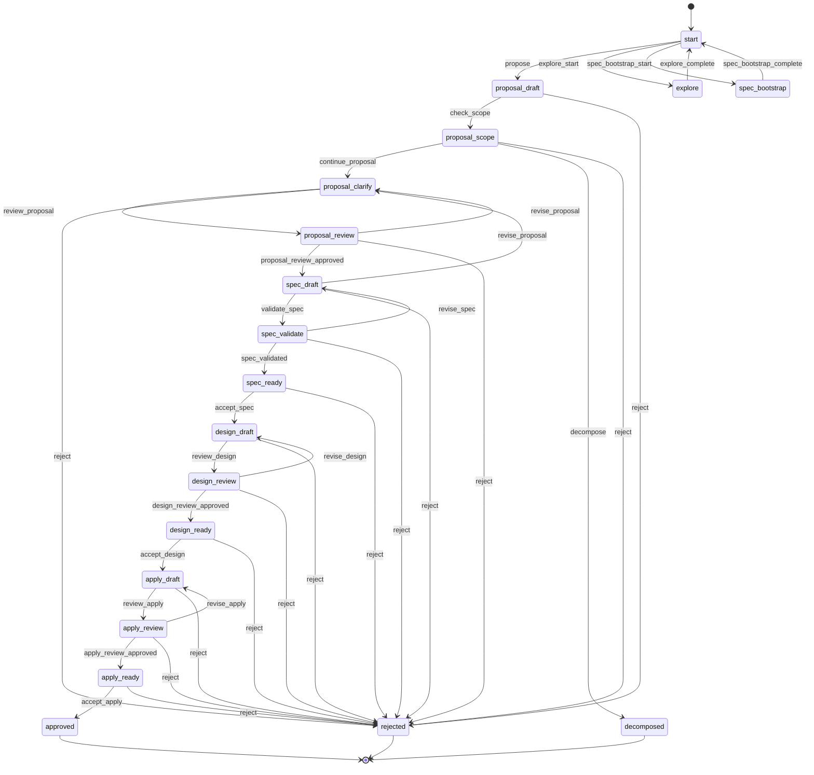

# specflow


[日本語](#セットアップ) | [English](#english)

GitHub issue URL またはインライン仕様記述を入力にして、Claude + Codex による proposal → clarify → spec → validate → design → implement → review のワークフローを Claude Code 内でインタラクティブに回すツール。

## セットアップ

### 1. 前提ツール

| ツール       | 用途                                     | インストール                             |
| ------------ | ---------------------------------------- | ---------------------------------------- |
| `gh`         | GitHub issue URL 入力時のみ必要         | `brew install gh && gh auth login`       |
| `claude`     | proposal の clarify / design / implement | Claude Code CLI                          |
| `git`        | リポジトリ操作                           | macOS 標準 or `brew install git`         |
| OpenSpec CLI | proposal/specs/design/tasks/implement 管理 | `npm install -g openspec` でインストール |
| `codex`      | Codex CLI (レビュー用 MCP サーバー)      | `npm install -g @openai/codex`           |

### 2. GitHub CLI 認証

```bash
gh auth login
gh auth status
```

### 3. インストール

```bash
npm install -g --force https://github.com/skr19930617/specflow/releases/latest/download/specflow-node.tgz
```

このコマンドは build 済み release tarball を取得し、`postinstall` 経由で `specflow-install` を自動実行する。

curl 版の bootstrap が必要な場合:

```bash
curl -fsSL https://raw.githubusercontent.com/skr19930617/specflow/main/install.sh | bash
```

ソースからの開発用インストール:

```bash
git clone https://github.com/skr19930617/specflow.git
cd specflow
npm ci
npm run build
node dist/bin/specflow-install.js
```

これで以下が自動で行われる:

- release tarball 内の `dist/package/` から配布用 bundle を展開
- `dist/package/template`, `dist/package/global` → `~/.config/specflow/` にコピー（init / update 時の参照元）
- `bin/specflow-*` → `~/bin/` にシンボリックリンク
- `dist/package/global/commands/specflow*.md` → `~/.claude/commands/` にコピー（スラッシュコマンド）
- `dist/package/global/claude-settings.json` の権限 → `~/.claude/settings.json` に差分マージ
- review prompt の JSON schema は prompt contract から build 時に生成

同じ npm コマンドを再実行すると latest release に更新される。ソースからの開発用インストールの場合は `npm run build && node dist/bin/specflow-install.js` を再実行する。スラッシュコマンドや review prompt の更新を反映するには、再 install が必要。

`~/bin` が PATH に入っていない場合はシェル設定に追加:

```bash
# bash/zsh
export PATH="$HOME/bin:$PATH"

# fish
set -gx fish_user_paths ~/bin $fish_user_paths
```

### 5. (任意) 外部テンプレートリポジトリの指定

デフォルトでは `specflow-init` は `~/.config/specflow/template/` からファイルをコピーする。
カスタムテンプレートを使いたい場合のみ環境変数を設定:

```bash
export SPECFLOW_TEMPLATE_REPO="your-user/specflow-template"
```

## 前提条件チェックとトラブルシューティング

specflow コマンド実行時に以下のエラーが表示された場合、対応するコマンドを実行してください:

| #   | エラー状態                  | 検出条件                             | 対処コマンド              | 結果                                |
| --- | --------------------------- | ------------------------------------ | ------------------------- | ----------------------------------- |
| 1   | OpenSpec CLI 未インストール | `openspec/` ディレクトリが存在しない | `npm install -g openspec` | OpenSpec CLI がインストールされる   |
| 2   | specflow 未初期化           | `.specflow/config.env` が存在しない  | `specflow-init`           | `.specflow/config.env` が生成される |

**新規セットアップの流れ:**

1. specflow をインストール: `npm install -g --force https://github.com/skr19930617/specflow/releases/latest/download/specflow-node.tgz`
2. OpenSpec CLI をインストール: `npm install -g openspec`
3. 対象プロジェクトで specflow を初期化: `specflow-init`
4. CLAUDE.md を設定: Claude Code 内で `/specflow.setup` を実行
5. `/specflow` を実行して開始

> **Note:** `specflow-init` は `.specflow/config.env`、`.mcp.json`、`CLAUDE.md` を生成し、`.gitignore` に `.specflow/runs/` などのローカル生成物を追加します。`openspec/` ディレクトリは `/specflow` 初回実行時に OpenSpec CLI が自動作成します。`/specflow.setup` は既存の `CLAUDE.md` をインタラクティブに設定するコマンドです。

## 使い方

### 1. 対象リポジトリで初期化（初回のみ）

```bash
cd /path/to/your-project
specflow-init
```

以下がプロジェクトルートに生成される:

- `.specflow/config.env` — エージェント設定
- `.mcp.json` — Codex MCP サーバー設定
- `CLAUDE.md` — Claude Code 用プロジェクト設定テンプレート
- `.gitignore` の specflow 用 ignore エントリ — `.specflow/runs/`、`.mcp.json`、Claude local settings

スラッシュコマンドを最新に更新したい場合:

```bash
specflow-init --update
```

> **Note:** 既存プロジェクトで `review_design_prompt.md` や `review_apply_rereview_prompt.md` が見つからない場合は、`specflow-install` を再実行してください。

### 2. CLAUDE.md のセットアップ

Claude Code 内で:

```
/specflow.setup
```

Tech Stack、Commands、Code Style をインタラクティブに設定して CLAUDE.md を更新する。

### 3. URL またはインライン仕様を渡して実行

Claude Code 内で:

```
/specflow https://github.com/OWNER/REPO/issues/123
```

または:

```
/specflow ユーザー認証の repo responsibility と non-goals を明文化する
```

URL なしで起動してインタラクティブに入力:

```
/specflow
```

### 4. `/specflow` のフロー

各コマンドは1つのフェーズだけを担当し、終了時に handoff ボタンで次のステップに進む。

```
/specflow           input normalize → local proposal entry → clarify → spec delta draft → validate
                    ┌─ [Design に進む]      → /specflow.design
                    ├─ [Explore]            → /specflow.explore
                    └─ [中止]              → /specflow.reject

/specflow.explore   アイデア探索・問題調査・設計検討のための思考パートナー
                    ┌─ [Spec に進む]        → /specflow
                    └─ [中止]              → /specflow.reject

/specflow.design    design/tasks artifacts 生成 → Codex design review
                    ┌─ [実装に進む]         → /specflow.apply
                    ├─ [Design を修正]      → /specflow.fix_design
                    └─ [中止]              → /specflow.reject

/specflow.fix_design Design/Tasks 修正 → Codex design/tasks review 再実行
                    ┌─ [実装に進む]         → /specflow.apply
                    ├─ [Design を修正]      → /specflow.fix_design
                    └─ [中止]              → /specflow.reject

/specflow.apply     implement → Codex impl review
                    ┌─ [Approve & Commit]   → /specflow.approve
                    ├─ [Fix All]            → /specflow.fix_apply
                    └─ [Reject]             → /specflow.reject

/specflow.fix_apply      指摘を修正 → Codex impl re-review
                    ┌─ [Approve & Commit]   → /specflow.approve
                    ├─ [Fix All]            → /specflow.fix_apply
                    └─ [Reject]             → /specflow.reject

/specflow.approve   commit → push → PR 作成
/specflow.reject    全変更破棄
/specflow.setup     CLAUDE.md をインタラクティブに設定
/specflow.decompose spec の複雑さを分析 → issue-linked spec は GitHub sub-issue に分解
/specflow.dashboard 全 feature のレビュー台帳を集計 → ダッシュボード表示・保存
/specflow.license   プロジェクト解析に基づいてライセンスファイルを生成
/specflow.readme    プロジェクト解析に基づいて OSS 風 README を生成・更新
```

#### フェーズの流れ

1. `/specflow` — source 正規化 → local proposal entry → clarify → spec delta draft → validate（OpenSpec CLI 連携）
2. `/specflow.explore` — (任意) アイデア探索・問題調査・設計検討
3. `/specflow.design` — design/tasks artifacts 生成 → Codex design review
4. `/specflow.apply` — OpenSpec apply → tasks 実装 → Codex apply review
5. `/specflow.approve` — commit → push → PR 作成

修正ループ:

- Design に問題 → `/specflow.fix_design` → design/tasks 修正 → Codex design/tasks re-review
- 実装に問題 → `/specflow.fix_apply` → 修正 → Codex impl re-review

ユーティリティ:

- `/specflow.decompose` — spec の複雑さを分析し、issue-linked spec は GitHub sub-issue に分解
- `/specflow.dashboard` — 全 feature のレビュー台帳を集計し、ダッシュボードとして表示・保存
- `/specflow.license` — プロジェクト解析に基づいてライセンスファイルを生成
- `/specflow.readme` — プロジェクト解析に基づいて OSS 風 README を生成・更新

## MCP サーバー設定

specflow は Codex CLI を MCP サーバーとして使い、proposal/design/実装のレビューを行う。

`specflow-init` がプロジェクトルートに `.mcp.json` を自動コピーする:

```json
{
  "mcpServers": {
    "codex": {
      "command": "codex",
      "args": ["mcp-server"]
    }
  }
}
```

Claude Code がプロジェクトを開くと `.mcp.json` を読み込み、`codex` MCP サーバーを自動起動する。
Codex CLI がインストール済みであれば追加設定は不要（Codex team プランの課金で動作）。

## 設定一覧

| 設定               | 場所                              | 設定方法                                   |
| ------------------ | --------------------------------- | ------------------------------------------ |
| Codex MCP サーバー | プロジェクトルートの `.mcp.json`  | `specflow-init` で自動コピー               |
| Codex CLI          | `codex` コマンド                  | `npm install -g @openai/codex`             |
| スラッシュコマンド | `~/.claude/commands/specflow*.md` | `specflow-install` で自動インストール      |
| Claude Code 権限   | `~/.claude/settings.json`         | `specflow-install` で自動マージ            |
| プロジェクト設定   | プロジェクトルートの `CLAUDE.md`  | `/specflow.setup` でインタラクティブに設定 |
| 外部テンプレート   | 環境変数 `SPECFLOW_TEMPLATE_REPO` | 任意 — デフォルトはローカルテンプレート    |

## ワークフローコア

specflow のワークフローは以下の 3 つのコアコンポーネントで管理される。詳細は [docs/architecture.md](docs/architecture.md) を参照。

| コンポーネント | ファイル                                          | 役割                                         |
| -------------- | ------------------------------------------------- | -------------------------------------------- |
| State Machine  | `dist/package/global/workflow/state-machine.json` | XState 由来の状態・イベント・遷移定義 (v4.0) |
| Run CLI        | `bin/specflow-run`                                | 状態遷移の実行・検証・per-run メタデータ管理 |
| Run State      | `.specflow/runs/<run_id>/run.json`                | per-run の状態・メタデータ・履歴             |

### 状態遷移図

<!-- BEGIN GENERATED WORKFLOW DIAGRAM -->



<!-- END GENERATED WORKFLOW DIAGRAM -->

**v4.0 破壊的変更**: proposal と design の間に spec phase (`spec_draft` → `spec_validate` → `spec_ready`) が追加され、OpenSpec `validate` は spec delta 作成後に実行されます。`/specflow.design` は `spec_ready` から開始します。

**ブランチパス**: `explore` と `spec_bootstrap` は state machine・`specflow-run`・生成済みスラッシュコマンドでサポートされる。`/specflow.explore` と `/specflow.spec` は synthetic run (`specflow-run start "<RUN_ID>" --run-kind synthetic`) を使って branch path event を記録する。

### run.json メタデータ

change run の canonical boundary は `openspec/changes/<CHANGE_ID>/proposal.md`
と `.specflow/runs/<run_id>/run.json`。スラッシュコマンドや GitHub issue URL
はこのローカル entry flow を呼ぶ adapter として扱う。

v4.0 の `run.json` は以下のフィールドを必須とします（`specflow-run start` 時に自動検出）:

| フィールド          | ソース                                             |
| ------------------- | -------------------------------------------------- |
| `source`            | `--source-file` で渡された正規化 metadata または `null` |
| `project_id`        | `git remote get-url origin` → `owner/repo`         |
| `repo_name`         | `project_id` と同値                                |
| `repo_path`         | `git rev-parse --show-toplevel`                    |
| `branch_name`       | `git rev-parse --abbrev-ref HEAD`                  |
| `worktree_path`     | `git rev-parse --show-toplevel`                    |
| `agents`            | `{ main: "claude", review: "codex" }` (デフォルト) |
| `last_summary_path` | `null` (approve 時に更新)                          |

synthetic run (`--run-kind synthetic`) では `change_name` は `null` で、追加で `run_kind: "synthetic"` が保存される。synthetic run は `openspec/changes/<run_id>/proposal.md` を要求しない。

**マイグレーション不要**: 既存の run.json は `.specflow/runs/` に gitignore されており、ローカルのみ。旧スキーマの run は破棄して `specflow-run start` で再作成。

### UI バインディングメタデータ分離

配信固有のメタデータ（Slack チャンネル等）は `run.json` に含めず、`.specflow/runs/<run_id>/<ui>.json`（例: `slack.json`）に分離する命名規約。

## リポジトリアーキテクチャ

### Legacy archive

Bash 時代の最終スナップショットは main ブランチには残しておらず、git tag `legacy-v1-final` に固定している。現行の build、runtime、CI test は archive 内の script を実行しない。

このリポジトリには 2 種類のコンテンツが含まれる:

1. **配布物 (Distributable Assets)** — ユーザープロジェクトにインストールされるツール
2. **リポジトリ計画状態 (Repository Planning State)** — specflow 自体の開発計画・設計資産

```
specflow/
├── bin/                           # 配布物: インストール・初期化スクリプト
├── assets/template/               # 配布物ソース: プロジェクトブートストラップテンプレート
├── dist/package/                  # 配布物: install が消費する bundle
└── openspec/                      # 計画状態: OpenSpec 準拠のリポジトリ内部資産
    ├── specs/                     #   Capability specs (現在の真実) — 現在は空
    ├── changes/                   #   Change records (提案・変更履歴)
    │   ├── <change-name>/          #     各変更の proposal / design / tasks
    │   └── archive/                #     完了済み変更レコード
    └── README.md                  #   OpenSpec ディレクトリ規約
```

### 配布物 vs 計画状態の区別

| ディレクトリ    | 種類     | 用途                                           |
| --------------- | -------- | ---------------------------------------------- |
| `assets/`       | ソース   | prompt/template のテンプレート                 |
| `dist/package/` | 配布物   | installer が配布に使う bundle                  |
| `bin/`          | 配布物   | インストール・初期化・ユーティリティスクリプト |
| `openspec/`     | 計画状態 | specflow 自体の proposal / design / tasks      |

## ファイル構成

```
specflow/                        # このリポジトリ（ツール）
  .claude/                       # Claude Code プロジェクト設定
    commands/opsx/               #   OpenSpec CLI 直接操作コマンド
    skills/                      #   スキル定義（openspec-apply-change 等）
    settings.json                #   プロジェクト権限設定
    settings.local.json          #   ローカル権限設定（git 管理外）
  bin/
    specflow-analyze             #   プロジェクト解析（言語、フレームワーク、ライセンス検出）
    specflow-create-sub-issues   #   GitHub sub-issue 作成
    specflow-fetch-issue         #   gh で issue 取得
    specflow-filter-diff         #   diff フィルタリング
    specflow-init                #   プロジェクト初期化 / コマンド更新
    specflow-install             #   グローバルインストール（PATH, コマンド, 権限, テンプレート）
    specflow-prepare-change      #   normalized source → proposal.md → run start
    specflow-run                 #   ワークフロー状態遷移 CLI (start/advance/status/update-field)
  assets/                        # build 入力テンプレート
    global/
      prompts/                   #   prompt テンプレート（schema は contract から注入）
    template/                    #   init 用テンプレートソース
      CLAUDE.md                  #     Claude Code 用プロジェクト設定テンプレート
  dist/
    package/                     #   install が消費する配布 bundle
      global/
        workflow/
          state-machine.json     #       状態遷移定義 (v4.0)
        commands/                #       スラッシュコマンド定義
        prompts/                 #       レビュー・ワークフロープロンプト
        claude-settings.json     #       ~/.claude/settings.json 用権限テンプレート
      template/                  #       init が参照する配布済みテンプレート
  openspec/                      # このリポジトリの計画状態 (OpenSpec)
    specs/                       #   Capability specs
    changes/                     #   変更レコード
    README.md                    #   OpenSpec ディレクトリ規約
  .gitignore                     # Git 除外設定
  .mcp.json                      # Codex MCP サーバー設定
  install.sh                     # curl ワンライナーインストーラー
  CLAUDE.md                      # プロジェクトガイドライン
  LICENSE                        # MIT License
  README.md

~/.config/specflow/              # specflow-install でコピーされる
  template/                      #   init 時の参照元
  global/                        #   update 時の参照元
```

## 貢献

コントリビューション歓迎です。お気軽に Pull Request をお送りください。

### 開発用コマンド

```bash
npm run lint
npm run format
npm run format:check
npm run test:coverage
npm run check
```

1. リポジトリをフォーク
2. フィーチャーブランチを作成 (`git checkout -b feature/amazing-feature`)
3. 変更をコミット (`git commit -m 'feat: add amazing feature'`)
4. ブランチにプッシュ (`git push origin feature/amazing-feature`)
5. Pull Request を作成

## ライセンス

このプロジェクトは MIT License のもとで公開されています。詳細は [LICENSE](LICENSE) ファイルを参照してください。

---

<a id="english"></a>

# English

An interactive tool that runs the full proposal → clarify → spec → validate → design → implement → review workflow inside Claude Code from either GitHub issue URLs or inline source text, using Claude + Codex.

## Quick Start

```bash
npm install -g --force https://github.com/skr19930617/specflow/releases/latest/download/specflow-node.tgz
```

This installs the prebuilt release tarball and runs `specflow-install` automatically during `postinstall`.

Bootstrap script fallback:

```bash
curl -fsSL https://raw.githubusercontent.com/skr19930617/specflow/main/install.sh | bash
```

Or install from source for development:

```bash
git clone https://github.com/skr19930617/specflow.git
cd specflow
npm ci
npm run build
node dist/bin/specflow-install.js
```

## Prerequisites

| Tool         | Purpose                                    | Install                              |
| ------------ | ------------------------------------------ | ------------------------------------ |
| `gh`         | Optional GitHub issue URL input            | `brew install gh && gh auth login`   |
| `claude`     | Proposal clarify / design / implement      | Claude Code CLI                      |
| `git`        | Repository operations                      | macOS built-in or `brew install git` |
| OpenSpec CLI | Proposal/specs/design/tasks/implement management | `npm install -g openspec`            |
| `codex`      | Codex CLI (review MCP server)              | `npm install -g @openai/codex`       |

## Usage

1. Initialize your project (first time only):

   ```bash
   cd /path/to/your-project
   specflow-init
   ```

2. Set up CLAUDE.md interactively in Claude Code:

   ```
   /specflow.setup
   ```

3. Start the workflow with a GitHub issue URL or inline source text:
   ```
   /specflow https://github.com/OWNER/REPO/issues/123
   ```

   or

   ```
   /specflow Document repository responsibilities and non-goals
   ```

### Workflow

```
/specflow          → proposal → clarify → spec delta draft → validate
/specflow.design   → design/tasks artifacts → Codex review
/specflow.apply    → implement → Codex review
/specflow.approve  → commit → push → PR
```

Fix loops: `/specflow.fix_design` (design fixes) and `/specflow.fix_apply` (implementation fixes).

Utilities: `/specflow.decompose` (split into sub-issues), `/specflow.dashboard` (review ledger dashboard), `/specflow.license` (generate license), `/specflow.readme` (generate README).

## Contributing

Contributions are welcome! Please feel free to submit a Pull Request.

### Development Commands

```bash
npm run lint
npm run format
npm run format:check
npm run test:coverage
npm run check
```

1. Fork the repository
2. Create your feature branch (`git checkout -b feature/amazing-feature`)
3. Commit your changes (`git commit -m 'feat: add amazing feature'`)
4. Push to the branch (`git push origin feature/amazing-feature`)
5. Open a Pull Request

## License

This project is licensed under the MIT License — see the [LICENSE](LICENSE) file for details.
